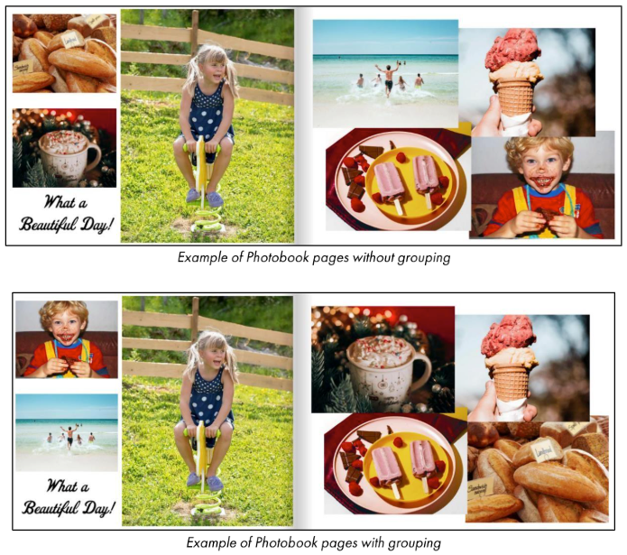
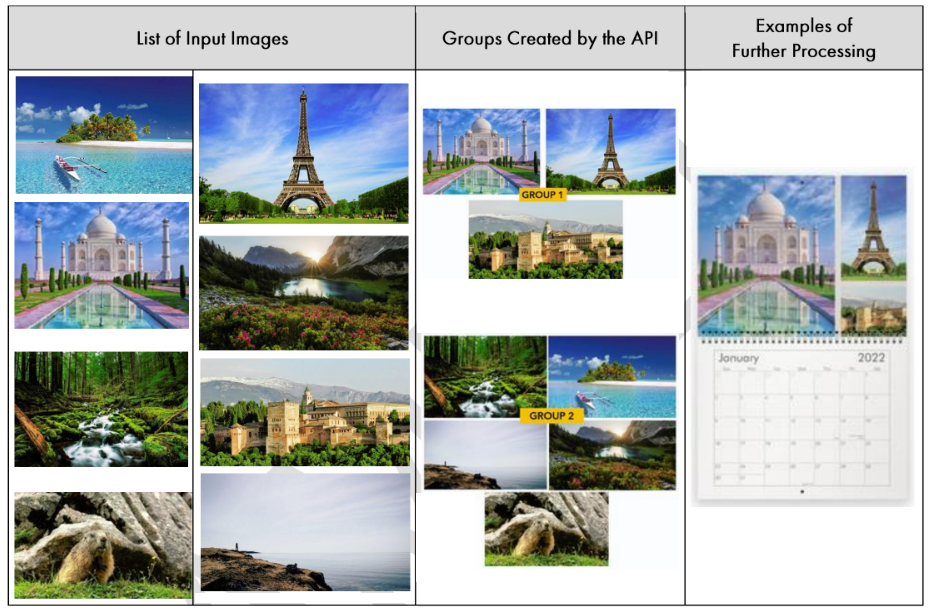

!!! example "About this article "
    Reference links to other articles are indicated but unavailable since these are sample documents.

## API Short Description
The **Group-image** API will segregate a given batch of assorted images into groups based on their contextual similarity i.e., likeness of the theme, color composition, focus objects, etc. in each image. You can define the number of groups that the API should generate, as well as the minimum and maximum number of images in each group.

The accepted input image formats are PNG and JPEG. Currently, SVG format is not supported.

## Use Case
For products such as photobooks, calendars, etc. where customers can upload multiple images, the Group-image API can be used to suggest arrangements of similar images on each page of the product; making it aesthetically and visually more appealing.



### Usage Example
The **Group-image** API groups the input images based on their visual similarity. In the example below, the API was instructed to greate a maximum of **2** groups.



## API Parameters
### Input
!!! success "Try it out!"
    For the latest details and to try out this API, _visit our Swagger page_.
 
**Input object**
```
{
  "input": {
    "urls": [
      "string"
    ],
    "totalGroups": 0,
    "minImagesPerGroup": 0,
    "maxImagesPerGroup": 0
  },
  "callbackUrl": "string"
}
```

`urls` - string - _(Required)_

* The list of URLs of the input images.

`totalGroups`: number - _(Required)_

* The number of image groups that the API should create.

`minImagesPerGroup`: number - _(Optional. Default:`1`)_

* The minimum number of images that a group should contain.

`maxImagesPerGroup`: number - _(Optional)_

* The maximum number of images a group can contain. If you do not specify any value, the API will automatically calculate the value.

`callbackUrl`: string - _(Optional)_

* If you specify this parameter, a callback will be made when the operation is completed. Please refer to _this link_ for more information.

### Output

```
{
  "id": "string",
  "status": "string",
  "callbackUrl": "string",
  "input": {
    "urls": [
      "string"
    ],
    "totalGroups": 0,
    "minImagesPerGroup": 0,
    "maxImagesPerGroup": 0
  },
  "output": {
    "info": {}
  },
  "imageGroups": [
    [
      "string"
    ]
  ]
}
```

|**Key**|**Description**|
|---|---|
|`id` | Unique ID of the request. This value is generated automatically.|
|`status` | Status of the request: `completed`, `running`, or `failed` |
|`callbackUrl` | Displayed only if you have defined its value in the input parameters |
|`input`| As described in _[input](#input)_|
| **Output info** |
|`inputImages` | Number of input URLs provided |
|`imagesConsidered`| Number of valid URLs considered for grouping by the API|
|`imageGroups`| An array containing arrays of URLs. Each array represents a group of contextually similar images|
|**Exception**|
|`status`| Status code of the _[error](#errors-and-exceptions)_|
|`title`| Title of the _[error](#errors-and-exceptions)_|
|`detail`| Additional information about the _[error](#errors-and-exceptions)_|

### Errors and Exceptions
|Status| Title| Detail|
|---|---|---|
|404 |`invalidInput`| Please provide the image URL as an input|
|||Request body is not a valid JSON|
|||Request parameter `url` is missing|
||`badInput`|Unable to load the image embedded in the URL|
||`unreachableUrl`|404 Client Error: Not found for `url`:"link of url"|
||`inputTooLarge`|Image above 5 MB cannot be handled|
||`inputTooSmall`|Image size should be greater than 80 pixels|


### Input and Output JSON Example

**Input JSON**

In the following example, a list of input image URLs is provided to the Group-image API and the number of groups that
should be created is specified as **2**:

```
{
  "input": {
    "urls": [
      "https://upxxxxs.documents.cxxxs.io/vl/upxxxxs/f0842709-1adf-3fe9b4cc91bc~122?tenant=doc-platform",
      "https://upxxxxs.documents.cxxxxxs.io/vl/upxxxxs/ae8ebdle-If79d038b82a~122 tenant=doc-platform",
      "https://upxxxxs.documents.cxxxxxs.io/v1/upxxxxs/279e2406-544a570d6ee2~122?tenant=doc-platform"
    ],
    "totalGroups": 2
  }
}
```

**Output JSON**

The API segregates the batch of images into **2** groups, given as **2** arrays in the output:
```
{
  "id": "242445f6-3eb2-4bd4-a61a-a610ef244de4",
  "status": "Completed",
  "output": {
    "info": {
      "inputImages": 4,
      "imagesConsidered": 4
    },
    "imageGroups": [
      [
        "https://upxxxxs.documents.cxxxxxs.io/v1/upxxxxs/£0842709-1adf-4475-b906-12036303281/spxx/a080bd1-5373-42c-8od2-?tentant=doc-platform"
      ],
      [
        "https://upxxxxs.documents.cxxxxxs.io/v1/upxxxxs/279e2406-еa54-434-807a-544a570d6ee2~122?tenant=doc-platform",
        "https://upxxxxs.documents.cxxxxxs.io/v1/upxxxxs/279e2406-ea54-434-807a-15?tenant=doc-platform",
        "https://upxxxxs.documents.cxxxxxs.io/v1/upxxxxs/214e2802-ea34-1234-807a-15?tenant=doc-platform"
      ],
      "input",
      ":",
      {
        "urls": [
          "https://upxxxxs.documents.cxxxs.io/vl/upxxxxs/f0842709-1adf-3fe9b4cc91bc~122?tenant=doc-platform",
          "https://upxxxxs.documents.cxxxxxs.io/vl/upxxxxs/ae8ebdle-If79d038b82a~122 tenant=doc-platform",
          "https://upxxxxs.documents.cxxxxxs.io/v1/upxxxxs/279e2406-544a570d6ee2~122?tenant=doc-platform"
        ],
        "totalGroups": 2
      }
    ]
  }
}
```