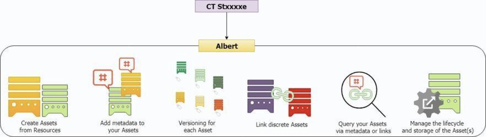

!!! example "About this article "
    Reference links to other articles are indicated but unavailable since these are sample documents.
    
## Introduction
Albert is a micro-service available in **Storage Services**. Through its APls, Albert provides several digital asset management functionalities. For example, you can add custom metadata to your resource and run queries using that metadata. You can create relationships to link resources together and execute queries to find resources via those relationships.



## Resources

### Assets
 
 Asset refers to the resource(s) that the user will store.  

 **Example 1**    
 Resource URI and its metadata:

 ``` 
 {
      "uri": "http://www.storage.cxxxxxs.io/objects/123",
      "metadata": {
        "objectSize": 200,
        "BU": "vxxxpxxxnt",
        "category": "face masks"
      }
    }
 ```

**Example 2**   
An image file and its metadata    
<_file_icons.png_> along with its metadata snippet:
```
{
  "metadata": {
    "objectSize": 200,
    "BU": "vxxxpxxxnt",
    "category": "face masks"
  }
}
```

## Types of Assets

**Managed Asset**: The lifecycle and storage of the resource is controlled entirely by Albert. The user only needs to
 provide the files or the URLs of the resource. Albert will generate a storage layer, and manage the creation, storage,
 and deletion of the resource.

!!! warning "Warning"
     An asset can be either unmanaged or managed; never both.    
     At the time of creating an Asset in Storage Services, the option selected in the field `Managed`/ `Unmanaged` is permanent. It will remain unchanged throughout all versions of the Asset's lifecycle.

**Unmanaged Asset**: The lifecycle of the resource is not controlled by Albert. It will merely store the URLs of the
 resource that are provided by the user. Albert will not be involved in maintaining the resource.

!!! info "Info"
     Refer to _this article_ for information on Asset Operations.

## Links
A link defines the relationship between two assets. The user can specify the type and nature of the relationship in any manner, and Albert helps to create and maintain the link. These links can then be used to query both assets.    

**Example** : The user defines a relationship between the original image and an enhanced image of a resource.
`Original Asset` > `Enhance API` > `Enhanced Asset`. With reference to the user-defined link `Enhance API`, the `Original Asset` is the source and the `Enhanced Asset` is the target asset.

!!! info "Info"
    Refer to _this article_ for information on **Link Operations**.

## Features - Why Use Albert?
As an Asset Management service, Albert enables users to: 

* Create Assets from their resources

* Add custom metadata to new and existing Assets

* Have a versioning system for each Asset

* Create user-defined relationships to link multiple Assets. A user can have any type of descriptive and queryable name for their links

* Query the Assets via metadata or links

* Control the lifecycle and storage multiple Assets in tandem with one another.

**Example**
> In this example, resources are referred to by their route for simplicity.

A Business wants to link an original customer design to the enhanced version. Currently, these resources exist as two separate entities `/v1/upx/(uploadIdOfOriginal)` and `/v1/upx/(uploadIdOfEnhancedVersion)` respectively in the UPX API. These entities are created by different actors but are easily linked using Albert.    

Now, if the Business wants to find the enhanced version of a customer's original upload, they can query `/v1/upx/{uploadIdOfOriginal}` and receive the contents of `/v1/upx/ {uploadIdOfEnhancedVersion}` in the result.

## Future Use

* Aggregate the resources of a Business into Collections, which can be operated on as a group.

* Lifecycle and Auth management of linked assets

* Create multiple linked assets from a single input (with GWM integration)

**Example**    

When a customer uploads a design, the _Original_, _Print_, _Preview_, and _Enhanced_ versions are generated and linked together.

!!! success "Support"
    If you need any specific information or assistance, please get in touch with us:
    
    Slack: #<channel name>
    
    Email: <emailid>