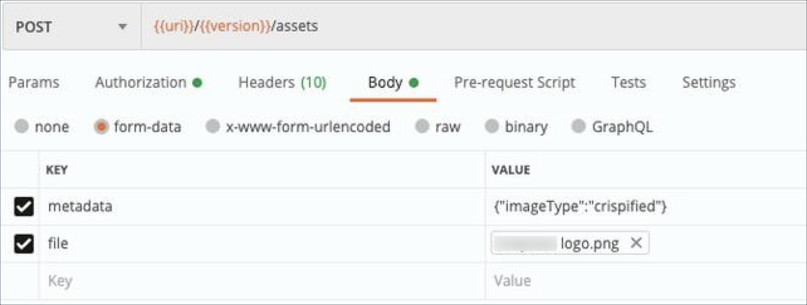
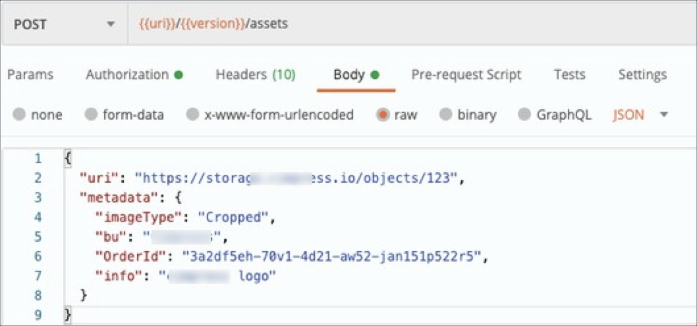

!!! example "About this article "
    Reference links to other articles are indicated but unavailable since these are sample documents.

!!! info "Info"
    To try out this API, go to _Swagger_.

## Creating an Asset
You can create

* a **managed** asset or 

* an **unmanaged** asset

***

## Managed asset

### Managed asset via file

**Path**: `v1/assets`

**Request**: `POST/v1/assets`

**Content Type**: multipart/ form-data

{ width="550" height="350" }

**Description**:

* It must be a single level key-value pair only.

* It cannot have embedded objects, nested objects, or arrays.

* Length of **key** = Max. 128 characters (128 bytes) and **value** = 50* 1024 characters (50KB)

`file`- file upload - _(Required)_

* Any valid binary file such as image, text, etc. Click **Choose File** to select the desired file.

`metadata`- object - _(Optional)_

* A key-value pair which provides metadata about the asset.

!!! note "Note"
    - File size should not be greater than 8GB for production & 4GB for non-production environment.    

    - While creating managed assets, it is recommended to stream the metadata before the file.

`expires`- string - _(Optional, Default: `P30D`)_

* The date and time at which the asset will cease to exist. The value can either be a duration in ISO8601 format, or `never`. 

* The value `never` indicates that the asset will exist perpetually i.e., without expiry. In asset and link responses, the same value is returned in the parameter `expiresOn`. If `"expires": "never"`, then `"expiresOn": null`.

***

### Managed asset via URI

**Path**: `v1/assets`

**Request**: `POST/v1/assets`

**Content Type**: application/ json

**Input**

`uri`- string - _(Optional)_

* A valid http or https URL of the resource that you want to use as an asset.

* Length of `uri`= Max. 512 characters.

* When creating an asset via `uri`, you must additionally specify the `managed` parameter.

`managed`- string - _(Optional, Default: `true`)_

* Its value can be either `true` or `false`. This parameter value is permanent for a created asset and cannot be changed with any subsequent `PUT` or `PATCH` requests.

    * `true` indicates a **managed** asset

    * `false` indicates an **unmanaged** asset.

`metadata`- object - _(Optional)_

* A key-value pair which provides metadata about the asset.

* It must be a single level key-value pair only.

* It cannot have embedded objects, nested objects, or arrays.

* Length of **key** = Max. 128 characters (128 bytes) and **value** = 50* 1024 characters (50KB)

!!! note "Note"
    It is necessary to define at least one of the parameters: `uri` or `metadata` while creating an asset.
    - Size of file, obtained from the parameter `uri` should not be greater than 8GB for production and 4GB for non-production environment.
    - While creating **managed assets**, it is recommended to stream the metadata before the file.

`expires`: string - _(Optional, Default: `P30D`)_

* The date and time at which the asset will cease to exist. The value can either be a duration in ISO8601 format, or `never`. 

* The value `never` indicates that the asset will exist perpetually i.e., without expiry. In asset and link responses, the same value is returned in the parameter `expiresOn`. If `"expires": "never"`, then `"expiresOn": null`.

***

## Unmanaged Asset

**Path**: `/v1/assets`

**Request**: `POST/v1/assets`

**Content-Type**: application/ json

**Input**
```
{
  "uri": "string",
  "managed": "false",
  "metadata": "object",
  "expires": "string"
}
```

`uri`- string - _(Optional)_

* A valid http or https URL of the resource that you want to use as an asset.

* Length of 'uri'= Max. 512 characters

* When creating an asset via `uri`, you must additionally specify the `managed` parameter.

`managed`- string - _(Required with `uri` parameter)_

* To create an unmanaged asset via `uri`, it is mandatory to specify `managed: "false"`. 

* This parameter value is permanent for a created asset and cannot be changed with any subsequent `PUT` or `PATCH` requests.

`metadata` - object - _(Optional)_

* A key-value pair which provides metadata about the asset.

  * It must be a single level key-value pair only

  * It cannot have embedded objects, nested objects, or arrays

  * Length of **key** = Max. 128 characters (128 bytes) and **value** = 50* 1024 characters (50KB)

!!! note "Note"
    You must mandatorily define at least one of the parameters: `uri` or `metadata` while creating an asset.
    
`expires` - string - _(Optional, Default: `P30D`)_

* The date and time at which the asset will cease to exist. The value can either be a duration in ISO8601 format, or `never`. 

* The value `never` indicates that the asset will exist perpetually i.e., without expiry. In asset and link responses, the same value is returned in the parameter `expiresOn`. If `"expires": "never"`, then `"expiresOn": null`.

{ width="550" height="350" }

***
