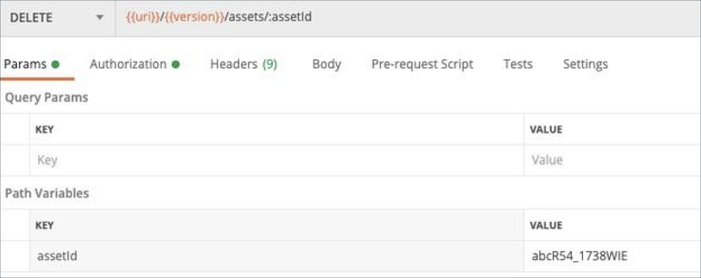
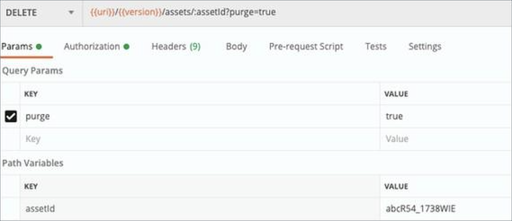

!!! example "About this article "
    Reference links to other articles are indicated but unavailable since these are sample documents.

This will eliminate the entire asset i.e., the current as well as previous versions. For **managed assets**, it also includes deleting the corresponding file resources. All versions will be marked as `deleted` and will be permanently deleted after a period of 90 days.

**Path**: `/v1/assets/{assetID}`

**Request**: `DELETE/v1/assets/{assetID}`

**Headers**:`If-Match` / `If-None-Match`

**Input**

`id` - string - _(Required)_    

* ID of the asset which you want to delete.

`If-Match` and `If-None-Match` - string - _(Required)_    

* At least one of these headers are required while deleting the asset, in order to maintain integrity and verify the correctness of the deletion. An Etag header will be received in the response after the asset is updated. For more details, _click here_.

`purge` - boolean - _(Optional, Default: `false`)_

* This is a query parameter, and the value is either `true` or `false`.    

* When `"purge": true`, it will permanently eliminate, with immediate effect, the entire asset i.e., the current as well as previous versions. For **managed assets**, it also includes deleting the corresponding file resources.

* After **Purging**, the asset cannot be recovered since this is an immediate and permanent deletion. When `"purge": false`, all versions of the asset will be marked as deleted and will be permanently deleted after a period of 90 days.

{ width="550" height="350" }

{ width="550" height="350" }

!!! note "Note"
    - Currently, bulk deletion of assets is unsupported.    
    - You need to have the requisite permissions in order to perform a deletion.