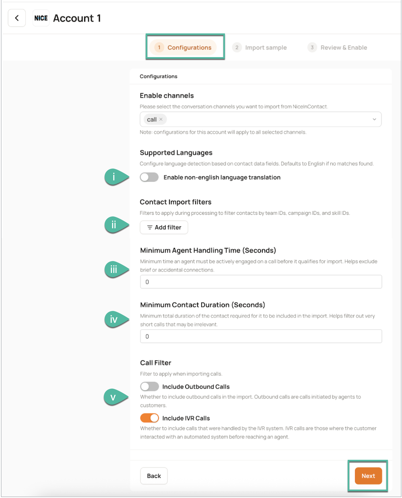

As an Admin or Super Admin, you can independently configure the Nice inContact integration within your **Acme AI** instance. This is a self-service option and eliminates the need to contact your **Technical Account Managers** (TAMs) for initial setup.

!!! note "NOTE"  
    To create a user account for use with the Acme AI integration along with the required **Access Key ID** and **Access Key Secret**, open the [**NICE CXone Mpower Getting Started page**](https://developer.niceincontact.com/Documentation/GettingStarted) and follow the steps listed in the section **Task 3: Prepare a Test User Account.**

## (A) Initiating the Nice inContact Integration

1.  In the left navigation bar, click **Settings >** click **Integrations.**
2.  Locate the **Nice inContact** integration option among the available integrations and click it.  
      
    

## (B) Connecting Nice inContact to your Acme AI Instance

3.  You will be prompted to provide the necessary connection credentials. These credentials authorize **Acme AI** to securely access and retrieve data from your Nice inContact environment. Please ensure you have the following information readily available and enter them in the corresponding fields:

*   **Access Key ID**: A unique identifier for the **Acme AI** application within your Nice inContact instance.
*   **Access Key Secret**: A confidential key associated with the **Access Key ID**, used for secure authentication.  
      
    

4.  You will be redirected back to the **Acme AI** platform and your Nice inContact account will be displayed under **Enabled Accounts**, indicating a successful authentication.  
      
    

## (C) Selecting and Configuring Import Channels

5.  Under **Enabled Accounts**, click the { width="25" height="25" } button **\>** **Configure**.  
      
    { width="550" height="550" }

## (D) Configuring Data Ingestion Parameters

**Acme AI** provides several parameters to filter and refine the data ingested from Nice inContact. These configurations allow you to focus on the most relevant data for your analysis. The following configuration options are available:

**(i) Language Translation:** You can configure Language translation by turning on the flag and entering the relevant metadata. You can select the field name, operator (Equals, Starts with, Ends with) and field value to identify the relevant language of the ticket.

**(ii) Data Filtering:** Refine imports by Team name, Campaign Name, and Skill Name

**(iii) Minimum Agent Handling Time:** Configure the minimum agent handling time to be ingested into Acme AI. Calls having agent handling time above this would be ingested.

**(iv) Minimum Contact Duration:** Configure the minimum total Call time to be ingested into Acme AI. Calls having total time above this would be ingested.

**(v) Include Outbound calls and Include IVR Calls:** Slide the respective toggle to enable or disable ingestion of outbound and IVR calls into your **Acme** instance.  
  
{ width="600" height="650" }
  
**Redaction and Booster Words**: You can enable and manage the Redaction and Booster words features for your imported data. This allows for sensitive data masking and highlighting of critical terms, enabling better compliance and transcription accuracy.

After configuring your preferences, click **Next** to proceed.

## (E) Importing Sample Data for Verification

Before fully enabling the integration, it is highly recommended to import a sample of your Nice inContact data into **Acme AI**. This allows you to verify your configured filters and ensure the data is being ingested as expected.  
  
{ width="550" height="550" }

You can choose to import data from the last 6, 12, or 24 hours.  
      
!!! not "NOTE"
     * The sample conversation import is limited to a maximum of 1000 conversations, regardless of the time period selected.  
    * Allow approximately 15-30 minutes for the sample conversations to load into **Acme AI**.

## (F) Reviewing and Enabling the Integration

1.  Once the sample data has been imported, carefully review each item in the provided checklist to confirm the accuracy of your configurations and the flow of conversations. Click the corresponding { width="25" height="25" } icon for for detailed instructions and screenshots.
2.  After you have thoroughly verified the sample data and are confident in your configurations, mark all the checkboxes in the checklist and click **Enable** to activate your Nice inContact integration.  
      
    { width="600" height="600" }

3.  In the dialog box that appears, click **Enable** to finalize your integration.  
      
    { width="600" height="600" }

## (G) Editing Integration Configurations

### Pausing the Data Pipeline

You can temporarily halt data ingestion from Nice inContact to **Acme AI** at any time.

1.  Under **Enabled Accounts**, click the { width="25" height="25" } button **\>** click **Pause**.  
      
    { width="600" height="600" }

2.  Confirm the action in the dialog box that appears.
3.  The account status under **Connected Accounts** will update to indicate that the pipeline is paused.

### Disconnecting the Account

If you no longer wish to continue with a specific Nice inContact account for importing data into **Acme AI**, you can disconnect it.

1.  Under **Enabled Accounts**, click the { width="25" height="25" } button **\>** click **Disconnect**.  
      
    { width="600" height="600" }  

2.  Confirm the action in the dialog box that appears.  
    The pipeline will be disconnected, and the account will be removed from **Enabled Accounts** and **Connected Accounts**.

### Renaming the Account

You can easily rename your connected Nice inContact account for better organization.

1.  Under **Enabled Accounts**, click the { width="25" height="25" } button **\>** click **Rename**.
2.  Enter the desired new name for the account in the provided field. The account will now display its new name.  
      
    { width="500" height="700" }

3.  Enter the desired new name for the account in the provided field. The account will now display its new name.  
      
    { width="500" height="700" }

### Connecting New Nice inContact Accounts to Acme AI

You can integrate multiple Nice inContact accounts with your **Acme AI** instance:

1.  In the Nice inContact Integration page, click **Add Account**.  
      
    { width="600" height="600" } 

2.  In the popup that appears, enter the credentials of the new Nice inContact account you wish to connect, then click **Connect to Nice inContact**.
3.  Continue by following the authentication steps [outlined here](#b-connecting-nice-incontact-to-your-acme-ai-instance).

## **Frequently Asked Questions (FAQs)**

**Q. What are the most frequently used configuration options in the Nice inContact self-serve integration?**  
**A.** Users commonly configure the integration to:  
\- Filter tickets by **Team Name, Campaign Name and Skill Name**  
\- Configure Call duration, Minimum Agent Handling Time, Minimum Contact Duration  
\- Configure call filters such as **Include Outbound Calls** and **Include IVR Calls**  
\- Enable **Redaction** and **Booster words** for better analysis  
\- Language Configuration

**Q. How often is data imported from Nice inContact to Acme AI?**  
**A.** The integration supports data import once every hour. This ensures near real-time visibility of your data without overloading the system.

**Q. Can historical Nice inContact calls data be pulled through the self-serve interface?**  
**A. No**, historical data pull is not supported in the self-serve setup. For historical imports, please contact your Technical Account Manager or the Acme AI support team for assistance.