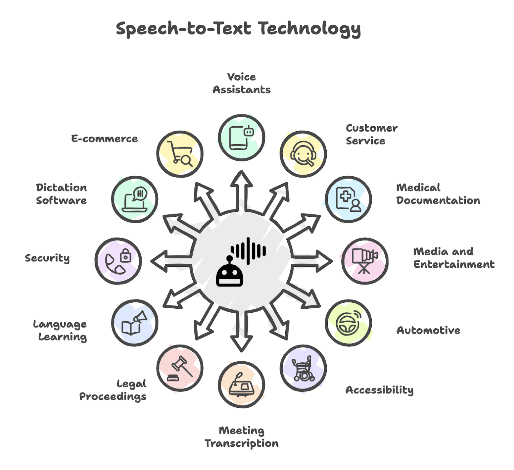
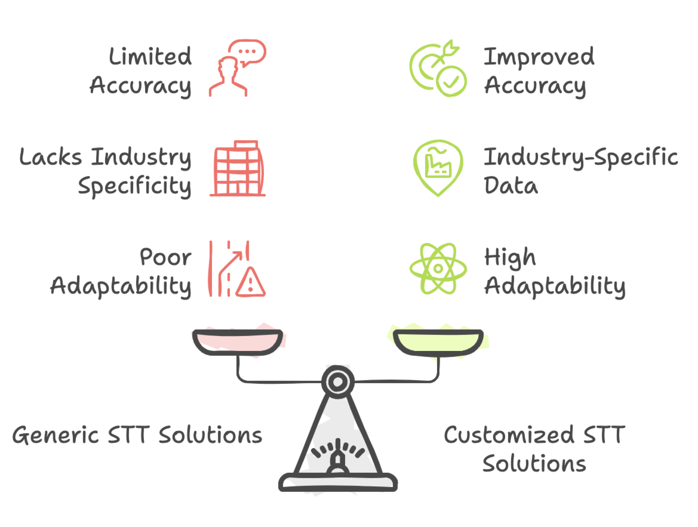
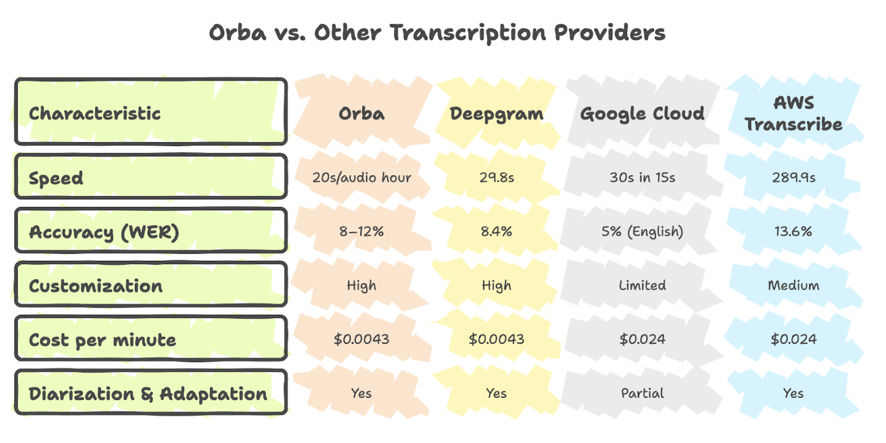
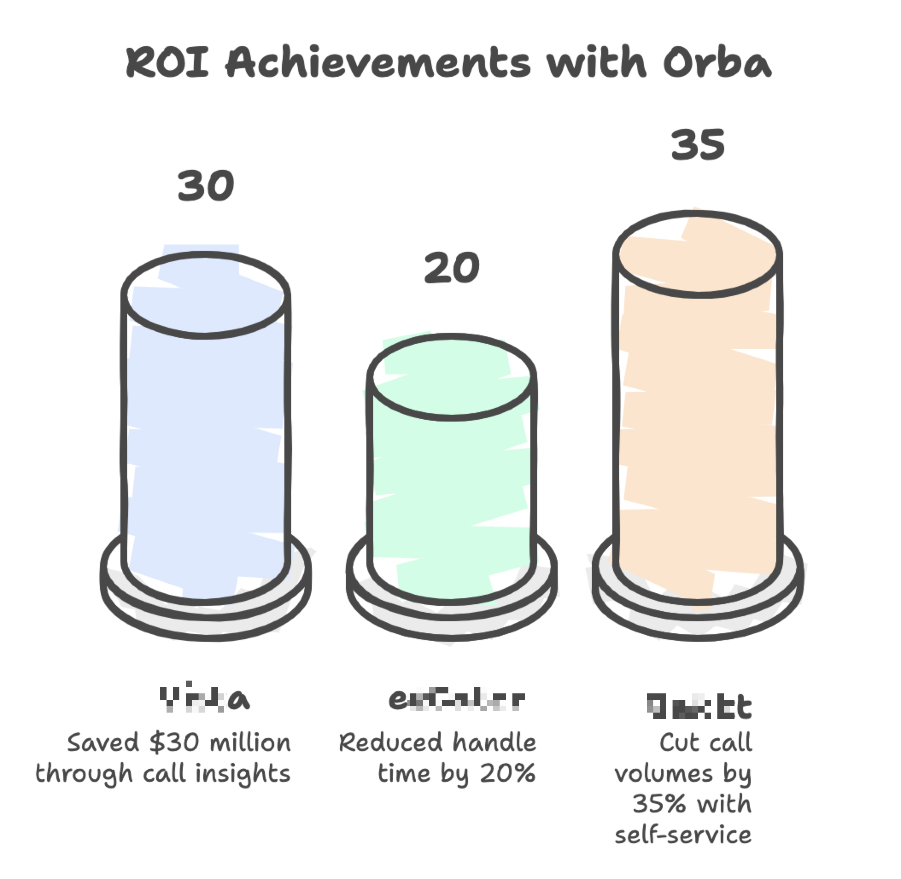

In today's fast-paced world, understanding every customer interaction is crucial. Nowhere is this more critical than in contact centers, where every word matters. Enter **Speech-to-Text (STT)**: the unsung hero of customer experience. Let’s explore how this powerful technology, and STT solutions such as **Zumo AI's Orba**, are transforming the way businesses listen, learn, and lead.

### **What is Speech-to-Text (STT)?**

Speech-to-Text (also known as Automatic Speech Recognition or ASR) converts spoken language into text. It’s like a superpowered digital notetaker; instantly transcribing customer calls, sales conversations, or supporting chats into searchable text. From everyday voice assistants such as Siri and Alexa to high-stakes use in healthcare or legal settings, STT is everywhere\! 

### **When STT Fails, So Does CX**

The accuracy of STT is non-negotiable. Imagine an agent trying to resolve an issue based on a garbled transcript. Poor STT quality can lead to:

* **Misunderstandings:** Incorrect transcriptions can lead to errors in customer service and data analysis. For example, a customer saying "product ID X-250B" could be transcribed as "eggs two fifty bee," causing confusion all around.  
* **Lost Insights:** Missed keywords and sentiment can hide crucial customer pain points; businesses lose valuable data that could be the foundation for major product improvements or service enhancements. For instance, you might miss a surge of calls complaining about a particular service if the STT isn't accurate enough to flag it.  
* **Wasted Time:** Correcting errors and clarifying misunderstandings takes time and resources, adding to operational costs. Agents have to manually verify information that the STT system got wrong, slowing down the entire chain of service.

Bad STT means higher costs, frustrated customers, and missed opportunities. So, how do you avoid this trap?

Test\! Test\! Test\! You must always cross-check whether an STT solution is compatible with your data.

### **Not All STT Are Created Equal**

STT performance is often measured by **Word Error Rate (WER)**. However, it has been observed frequently that any STT solution built over generic AI models struggle to remain accurate in real-world contact center scenarios— they’re unable to recognize industry-specific jargon, complex alphanumeric strings such as account numbers or product codes and moreover, unable to deal with accents, dialects and background noise. This is where **customization** is crucial. An STT solution that allows you to finetune the underlying AI models with your unique industry data significantly improves accuracy, making them truly effective for your business.

Does such a solution actually exist? Yes, indeed\!

### **Meet Orba: The only STT Built for Contact Centers\!**

**Zumo AI**’s **Orba** isn’t just another STT engine. It’s purpose-built for contact centers, trained on vast amounts of real support conversations across industries such as finance, healthcare, and retail. Orba doesn’t just hear—it *understands*.

**Under the Hood**

Unlike other solutions built on rented LLMs and generic APIs, Orba is powered entirely by Zumo AI’s proprietary models—built and hosted on our own GPUs, tuned for the unique demands of customer experience workflows.

This means:

* Better control over accuracy  
* Faster performance (just 20 seconds per audio hour)  
* Lower cost ($0.0043/minute vs. $0.024/minute for others)  
* Full customization with context biasing, keyword boosting, and diarization for call transfers

### **Why Orba Stands Out**

✔️ **Industry Smarts:** Trained on contact center-specific language and use cases.  
✔️ **Pinpoint Accuracy:** Gets product names, account numbers, and jargon right minimizing costly errors.  
✔️ **Deep Customization:** Adapts to your vocabulary, brand, and even agent accents.  
✔️**Scalable:** Handles millions of conversations for numerous enterprise customers without breaking a sweat  
✔️ **Unrivaled Efficiency:** Faster transcription and data processing improve operational efficiency across the board.  
✔️ **Valuable Insights:** Highly accurate data fuels robust analytics, powers intelligent quality assurance, and enables smarter strategic decisions in your organization.

**How Orba Stacks Up**

Compared to other transcription providers, Orba offers unmatched value:

*WER \= Word Error Rate; lower is better. Orba is optimized for noisy, real-world customer service calls.*

### **The ROI Is Real**

Companies using **Orba** see results\! 

* **Vista:** Saved **$30 million** by reducing refunds through better call insights.  
* **ezCater:** Cut average handle time by **20%**, improving agent efficiency.  
* **Bakkt:** Reduced call volumes by **35%** with STT-powered self-service strategies.

### **Summing it all up: STT Isn’t Just Tech—It’s Strategy**

STT is no longer optional, it’s essential for contact centers aiming to scale smartly, serve better, and compete harder. But not just any STT will do. With **Zumo AI**’s **Orba**, you're not just transcribing conversations—you’re turning them into actionable intelligence.

Want to improve CX, reduce costs, and drive real results? Start by listening better with **Orba**.