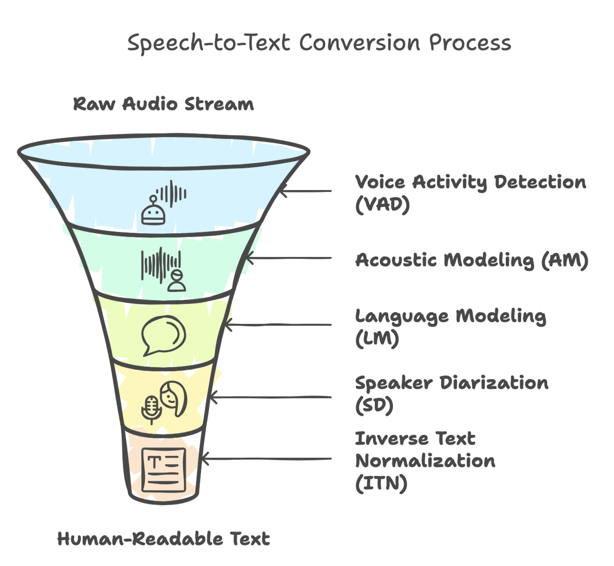
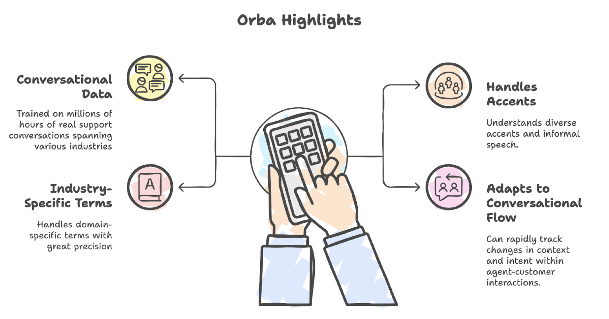

# **How Speech-to-Text Transcription Works**

Ever wonder how your voice assistant understands you, or how customer calls get transcribed into neat, searchable text? It all starts with **Automatic Speech Recognition (ASR)**. ASR is the technology that turns spoken words into written text, acting as the silent workhorse behind everything from transcribing a customer support call, powering voice assistants, to generating real-time captions.

This blog unpacks the core components of ASR technology. We'll explore how each stage contributes to accurate, context-aware transcription, and specifically how **Zumo AI**'s proprietary model, **Orba**, is engineered for the unique demands of contact center conversations.

## **The Five Pillars of ASR Systems** 

Accurate speech-to-text conversion is the result of a multi-stage process—each component plays a critical role in ensuring the output is not just technically correct, but **useful and human-readable**. Here's a closer look:

### **1\. Voice Activity Detection (VAD)**

VAD is the ASR system’s gatekeeper. Its job is to filter the audio stream and detect **when actual speech occurs**;   separating it from silence, background music, coughs, or keyboard clicks.

**How it works:** VAD uses short-time energy and spectral features of the audio signal to flag segments that contain voice activity. In modern systems, deep learning models like CNNs (Convolutional Neural Networks) or RNNs (Recurrent Neural Networks) trained on diverse audio environments provide more robust detection, even in noisy settings.

**Real-world Example:** During a call, an agent might put a customer on hold. VAD identifies the call hold music as non-speech and ensures it is not passed to later ASR stages, preserving compute resources and reducing false positives in transcription.

**Why it matters:** Without VAD, background noise and silence would clutter the system with irrelevant data; leading to **erroneous transcripts, increased latency**, and unnecessary compute usage.

---

### **2\. Acoustic Modeling (AM)**

Once VAD isolates the speech regions, the AM takes over. It analyzes short fragments of the audio; typically **20 to 30 milliseconds**, and converts them into **phonetic or character-level probabilities**.

**How it works:** The AM maps audio features e.g., MFCCs (Mel-Frequency Cepstral Coefficients), spectrograms etc. to linguistic units using models like HMMs (Hidden Markov Models), DNNs (Deep Neural Networks), or end-to-end transformers (like Conformers). It is trained on **thousands of hours of labeled speech data** to learn how sound patterns correspond to sounds in language.

**Real-world Example:** When a customer says _“tracking number”_ the AM hears the raw sound waves and produces something like:  
 t-r-a-k-i-ng n-u-m-b-e-r.

**Challenges:**

* **Homophones:** The AM alone cannot distinguish between _“there”_ and _“their”_ because they sound identical.

* **Accents and emotions:** It must account for various accents, speaking speeds, and expressions of emotion (anger, confusion), which can distort pronunciation.

---

### **3\. Language Modeling (LM)**

This is where context comes into play. The LM takes the noisy or uncertain outputs from the acoustic model and uses **contextual knowledge** to form coherent, grammatically and semantically meaningful phrases.

**How it works:** LMs are trained on massive amounts of text data to understand how words typically appear in sequences.  They learn probabilities of word sequences; e.g., _“cancel my order”_ is far more likely than _“candle my order”_, even if both sound similar. Advanced LMs use n-grams, RNNs, or Transformers (like GPT-style models) to accurately predict word sequences.

**Real-world Example:** If the AM outputs _“I want to no my bill”_ the LM corrects it to:  
 _“I want to know my bill”_  because it understands that _“know”_ is more probable in this context than _“no”_.

**Why it matters:** LMs are crucial for resolving ambiguity, distinguishing homophones, and correcting mispronunciations; making transcripts readable, accurate, and aligned with **how humans interpret language**.

---

### **4\. Speaker Diarization (SD)**

In real-world conversations, especially contact center calls, **both participants speak on the same channel**. SD helps determine **who spoke when**.

**How it works:** The model segments the audio and clusters parts of the waveform, assigning them to different speakers.This involves  using embeddings (like x-vectors) and clustering algorithms (e.g., spectral clustering) to identify distinct voices. Some systems also use auxiliary data like speaker IDs in multi-channel recordings.

**Real-world Example:** In a call like:

* Speaker A: _“I’m having issues with my internet.”_

* Speaker B: _“Let me check that for you.”_

SD ensures that the transcript is structured like:  
 Customer: _I’m having issues with my internet._     
 Agent: _Let me check that for you._

**Why it matters:** Without SD, the transcript would be a **confusing block of text**, making it impossible to separate agent responses from customer concerns; undermining both analytics and usability.

---

### **5\. Inverse Text Normalization (ITN)**

Raw ASR output often contains literal transcriptions of how things sound, not how they should appear in writing. ITN converts spoken phrases into their proper standardized, readable formats.

**How it works:** ITN applies rule-based or ML-based mappings to detect and normalize numbers, dates, times, currencies, abbreviations, and common entities.

**Real-world Example:**  
 Spoken: _“The total is seventy eight dollars and fifty five cents”_  
 Raw ASR: _“seventy eight dollars and fifty five cents”_  
 ITN Output (Transcribed): **$78.55**

Spoken: _“call me at eight zero eight three two one four seven nine nine”_  
 Output: **Call me at 808-321-4799**

**Why it matters:** ITN makes the transcript **actionable**, especially for downstream systems such as analytics engines, chatbots, or CRM integrations.

 Speech-to-text transcription is not just about recognizing words; it is about understanding who is speaking, what is being said, and how it should be interpreted. From detecting voice activity in noisy environments to resolving homophones with language context, each component plays a vital role.

## **Powered by Conversations: Zumo AI's In-House ASR Model \- Orba**

At Zumo AI, our transcription engine, **Orba**, isn’t just another generic speech-to-text tool, it is a **domain-trained ASR system built for contact centers**. Our in-house model is trained on **millions of hours of conversational data** spanning industries like telecom, retail, healthcare, and finance.

This deep, real-world exposure enables **Orba** to:

* Understand diverse accents, interruptions, and informal speech common in support calls.

* Handle domain-specific terms with precision, such as _“claim number”_, _“plan ID”_, or _“routing issue”_.

* Adapt to the dynamic **conversational flow** of agent-customer interactions, where intent and context shift rapidly.

The result is a high-accuracy, real-time ASR system that truly understands the **language of support**.