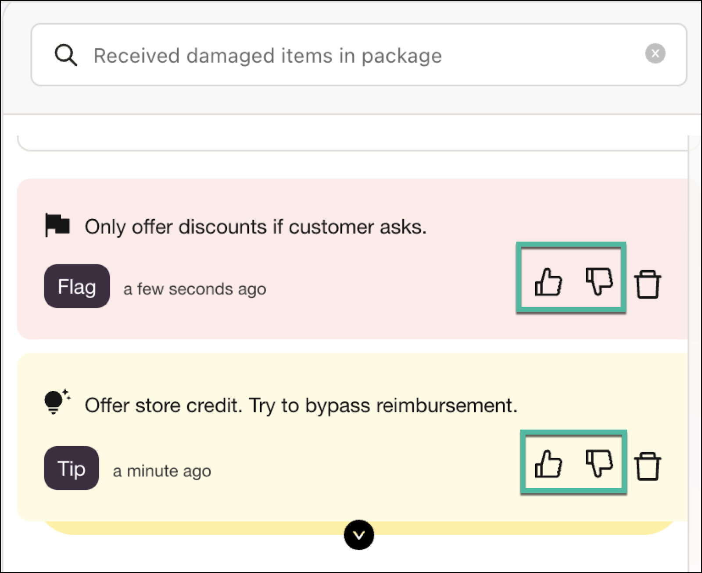
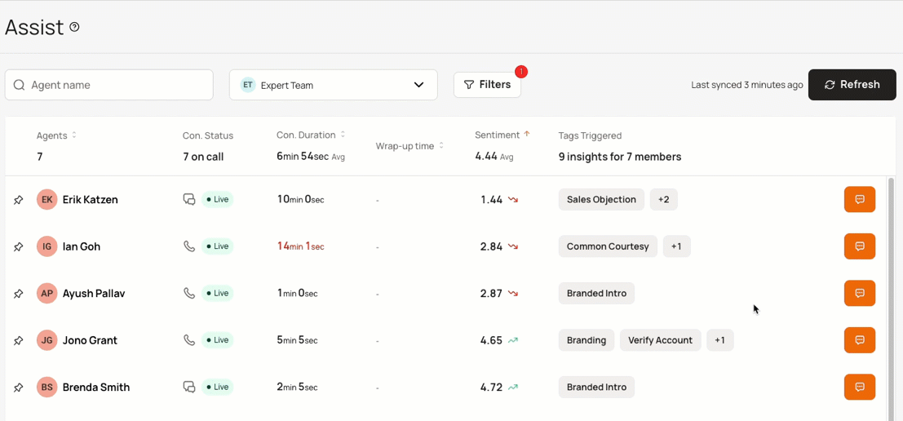
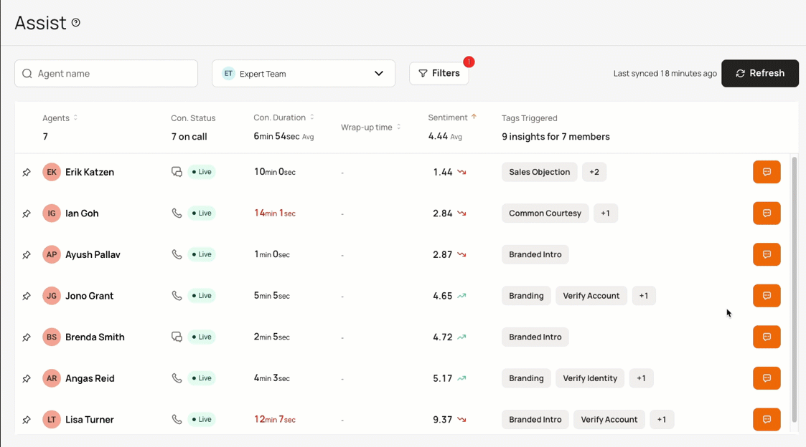
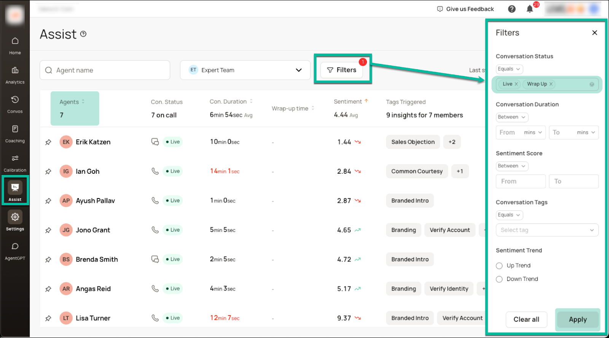
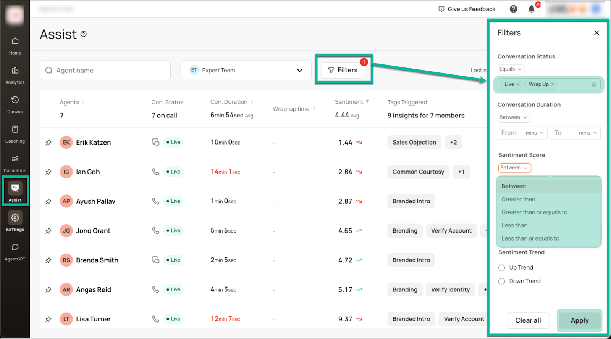

* * *

## For Agents

### **How do I log in?**

**A:** You can either use the SSOs available with your organization or use your Zumo AI credentials (please check with your IT department if you don’t have this).

### **When do Knowledge Cards pop up?**

**A:** Knowledge cards automatically appear when the AI system detects something in the conversation that can be explained with an article that is currently available in your company's Knowledge Base.

### **Why should I trust AgentGPT responses?**

**A:** The underlying sources from which AgentGPT extracts information is provided right below the response, so you can verify its accuracy.

### **How do I give feedback when the AI is wrong?**

**A:** Please use the thumbs up and thumbs down buttons to provide feedback to the AI system, which should improve over time.  
{ width="400" height="350" }

### **What do I do if the conversation is not loading in Agent Assist?**

**A:** If nothing is loading at all, including the real-time transcript at the bottom, it most likely is an issue with streaming the calls from your CCaaS. Please reach out to your manager to raise a ticket and the Zumo AI Support team will follow up accordingly.  
  

* * *

## For Managers

### **What do I do if conversations are not loading in Manager Assist?**

**A:** If conversations are not matching with your CCaaS or other system of record, please raise a ticket and the Zumo AI Support team will follow up accordingly.

### **How do I add a live conversation to a future coaching session?**

**A:** Hover your cursor over the row containing the desired conversation. The **Add to Coaching** icon  appears; click  to add the conversation to either a new or existing coaching session. 
  

### **How do I view the live transcript of a conversation?**

**A:** Click the { width="40" height="40" } icon corresponding to the conversation you’d like to view. In the callout that appears, click the **View Conversation** button to see the complete transcript; displayed in a new tab in your browser.  
  

  

### **How do I view all the live conversations for a single agent?**

**A:** You will need to define a few additional filters:    
First, select **Live** conversations (and **Wrap Up** if applicable).     
Click **Apply** to activate your selected filters.     
Then, sort the conversations by Agent.     
You can scroll to see all the live conversations in which any particular agent is participating.  
  
  
  

### **How do I set up filters?**

**A:** Click **Filters** to define the filters you would like to apply. You can change the qualifier as necessary. For example, you can choose **Between**, **Greater than,** and **Less than** amongst others, when filtering on **Sentiment Score**. Ensure that you click the **Apply** button to activate your chosen filters.  
  

* * *