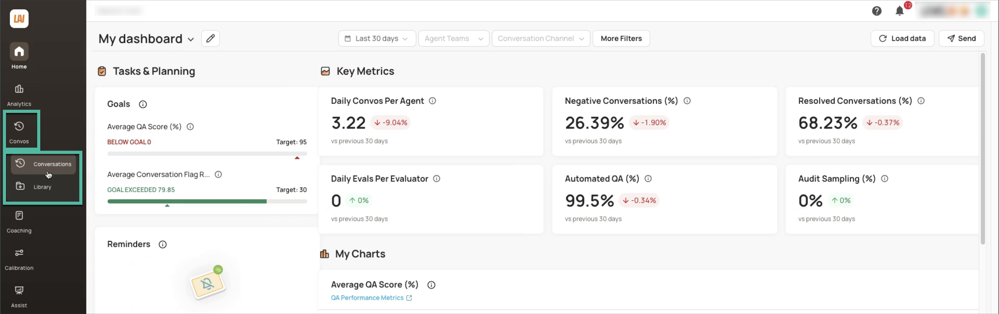
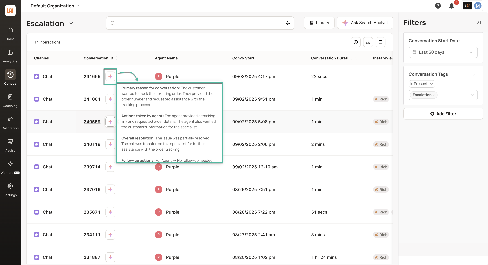
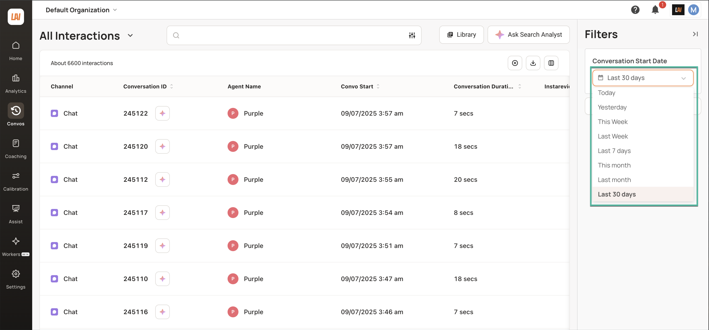
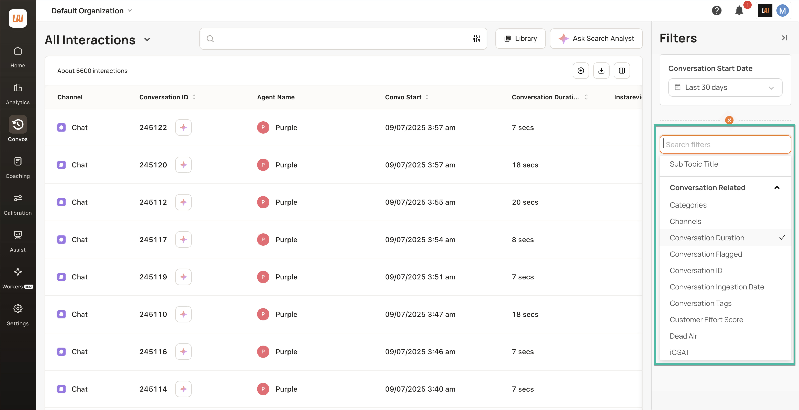
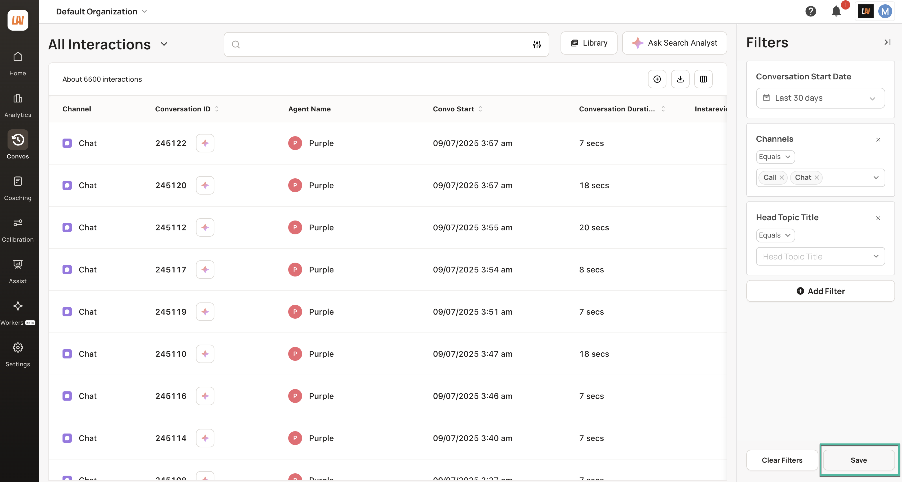
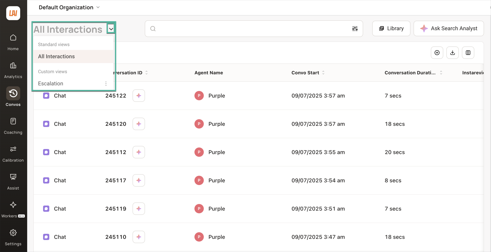
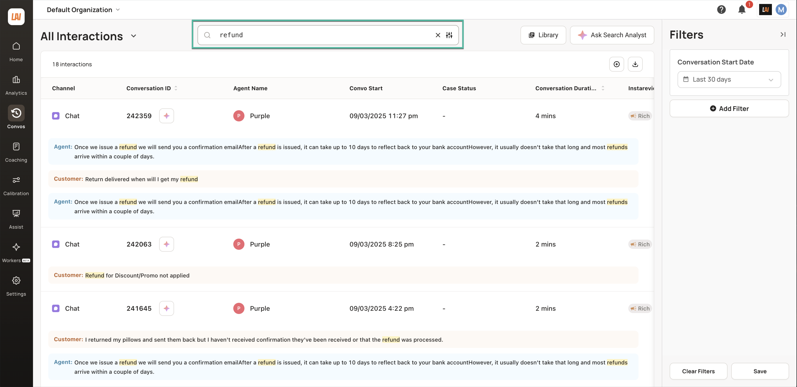
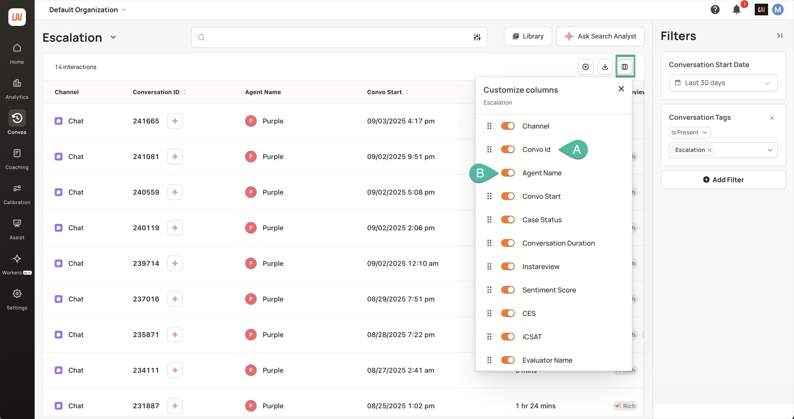
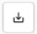
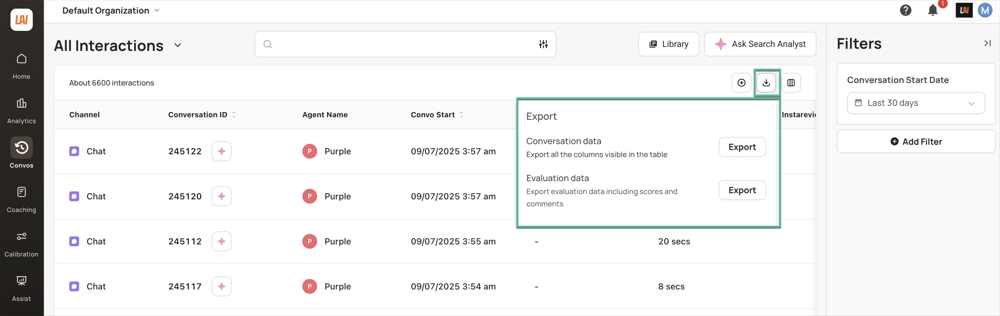

!!! example "About this article "
    Reference links to other articles are indicated but unavailable since these are sample documents.

## Accessing your conversations

1.  To view a list of all your past conversations, from the Left Navigation Bar, click **Conversations** **>** click the **Conversations** sub-option.  
      
      
    
2.  A table listing various interactions along with their details are displayed. By default, conversations from the past 30 days are shown.
3.  Hover over the { width="30" height="30" }icon to read a summary of the corresponding conversation.  
      
    

### Finding Specific Conversations

#### Using the Filters Panel

1.  Use the dropdown to modify the time period.  
      
      
      
    
2.  You can use various filters available in the **Filters** panel to refine and extract specific data. All filter options are organized into categories for easy identification. The **Interaction Field** category contains data imported from your CRM platform, such as Salesforce or Freshdesk, which you can use as filters.
    
!!! info "INFO"  
    For more information on how to use filters, refer to _this article_.

  

If you use a set of filters frequently, you can save them as **Views** using the **Save** button at the bottom right of the screen. This will help you to retrieve your data quickly without repeatedly configuring your filters each time.  
      
  
    
!!! info "INFO"  
    For more information on creating and using views, refer to _this article_.
    
To return to the standard view where interactions of the last 30 days are displayed, from the **Views** dropdown, click **All Interactions**.  

#### Using Search Transcript

You can find conversations by entering words or phrases mentioned by the customer or agent in the **Search Transcript** field. For example, typing in _refund_ in the text field and clicking **Search** will display all relevant conversations in which the customer or agent mentioned the word _refund_.

!!! tip "TIP" 
    The search results will highlight your search term for easy reference; customer utterances are marked in blue and agent utterances in orange, making it easy to identify relevant conversations.

!!! info "INFO" 
    For more information on how to use **Transcript Search**, refer to _this article_.

### Rearranging table columns
To rearrange or modify the columns of your table, click the **Column Customizer** button. Drag and drop column names **(A)** to rearrange them.  
Toggle the slider **(B)** to display or hide columns as needed.

!!! info "INFO"  
    For more information on customizing the display of the interactions table, refer to _this article_.

  
  
### Exporting Table Data

You can download your table data as a CSV file for offline analysis or sharing by clicking { width="30" height="30" }. Select your preferred option and click the corresponding **Export** button. A download link will be sent to your email address.  
  
