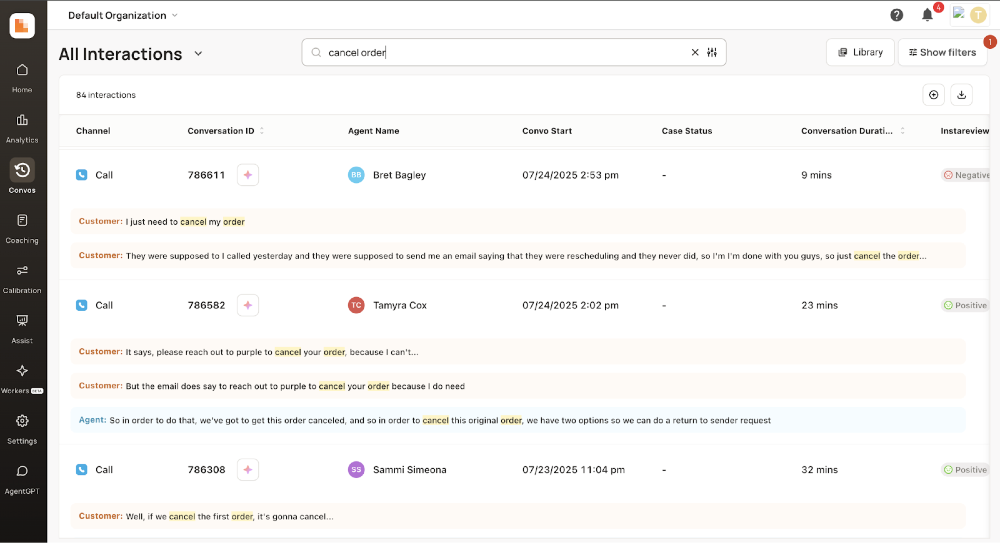
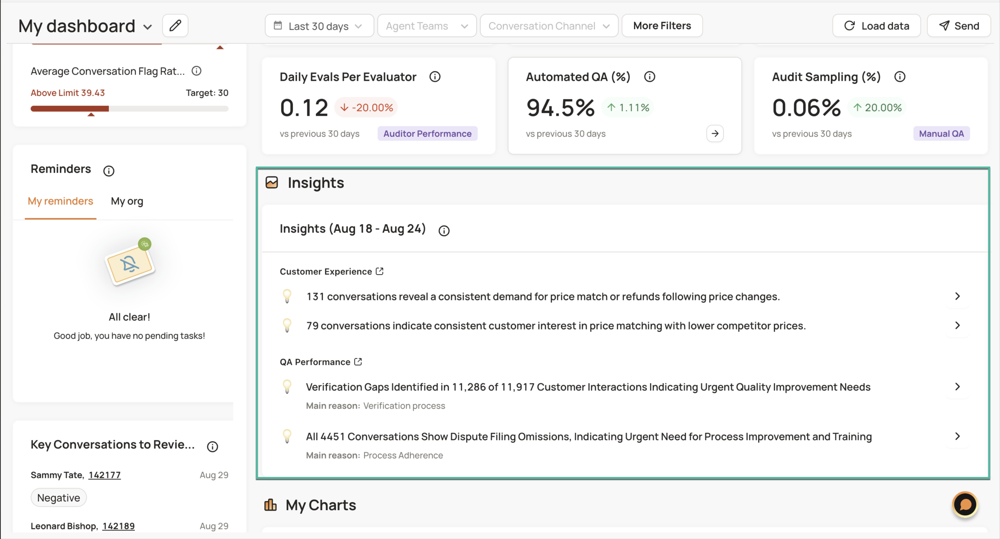
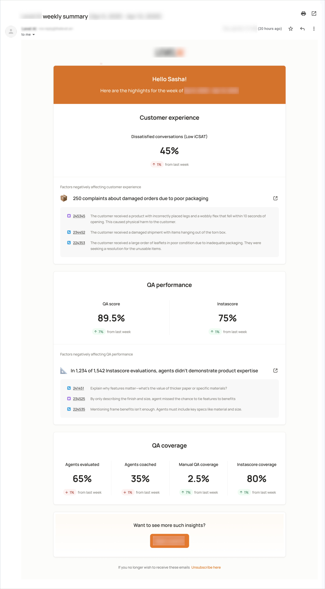

!!! example "About this article "
    Reference links to other articles are indicated but unavailable since these are sample documents.

## **(July 2024) What's new in this release**

## 🟢 Available to all

### Conversations Search Enhancements

We've launched several new enhancements to the conversation search experience, making it faster and easier to find the exact conversations you're looking for.
     
:orange_book: Refer to _this support article_ to learn more.  
  

**Highlights:**

*   **Smarter Multi-Keyword Search**: When you search for multiple keywords (e.g., "cancel order"), our improved search will now find conversations where those words appear within 5 words of each other, providing more relevant results.
*   **Powerful Queries**: Our new **Advanced Search** feature allows you to build complex queries using `AND`, `OR`, and `NOT` operators.
*   **Expanded Search Options**: You can now search directly by agent name, agent email, evaluator name, or evaluator email.
*   **Recent Searches**: Save time with **Recent Searches**, which automatically saves your last three queries for up to 12 hours.
*   **One-Click to Conversation**: Searching by a Conversation ID now takes you directly to the conversation page.
*   **Easy Sharing**: A new **Copy to clipboard** icon lets you easily share shortened conversation links.

These updates, along with a redesigned list view, give you a cleaner, more efficient search experience.

### New: Executive Summary Assistant

We're excited to introduce **Executive Summary**, our newest AI Assistant designed for in-depth analysis. While our existing **Search Assistant** is great for quick, tactical insights, **Executive Summary** is built to produce an executive-grade report by turning large volumes of conversations into a strategic, long-form document.   
  
It takes a single high-level business question, such as _What's driving negative CSAT over the last three months?_ and:  
\- automatically breaks it down into 10–15 sub-questions  
\- runs multiple deep-search queries in parallel and synthesizes the results into a detailed report. This process, optimized for depth over speed, takes approximately 5–7 minutes to run.

**Executive Summary** delivers strategic clarity and actionable insights, making it perfect for quarterly reviews, product audits, and board-level reporting. The output includes an executive summary, thematic analysis, key metrics, and actionable recommendations. You can also re-run the same prompt over time to track key trends and measure performance month over month.

:orange_book: Refer to _this support article_ to learn more.  

### Restart Chat

The new **Restart Chat** feature that allows you to reopen and continue any previous conversation with an AI Assistant, regardless of when it occurred. Previously, navigating away from a conversation would end it, forcing you to start over. This new feature provides contextual continuity, allowing you to pick up exactly where you left off with any of our AI Assistants (including Search, Coach, Data Sentiment Insights, iCSAT, Resolution Insights, and Deep Research Assistants) and continue your analysis with the original context intact.

* * *

## 🟨 Early Access

> Rolling out to select accounts.

### Insights panel on Homepage and Email Digest for CX Leaders

We've introduced customized weekly insights for leaders, delivered directly to the **Homepage** and via **email digest**. This brings the most critical data points such as key metrics in CX, QA Performance, and QA Coverage directly to users, making it faster and easier to spot trends without navigating multiple dashboards.

A new **Leader** label in user profiles ensures these targeted insights reach the right people (only admins and superadmins can be set as a leader). Every Monday at 9 a.m. PST, leaders will receive a personalized email summarizing the previous week's data. For all other users, the **Homepage** and **email digest** will remain unchanged.  
  
{ width="700" height="650" }

{ width="600" height="850" }

* * *

## 🌐 Bug Fixes

We identified rough edges and smoothed them out to make your **Acme AI** experience better ! :light_bulb: