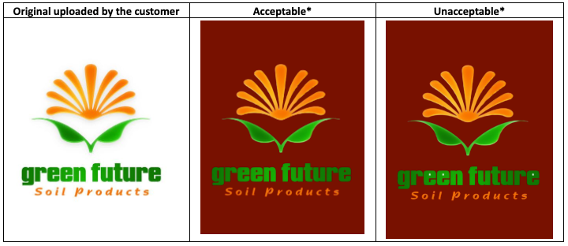
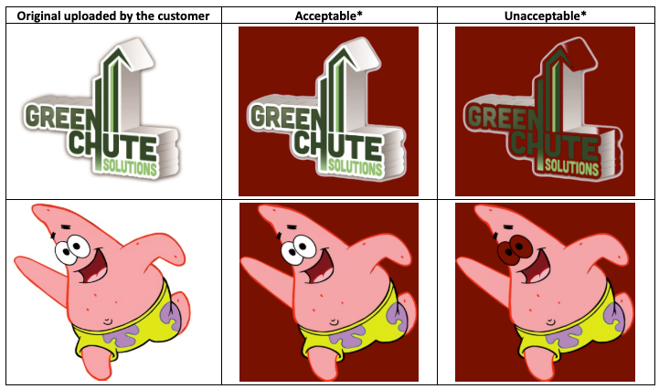
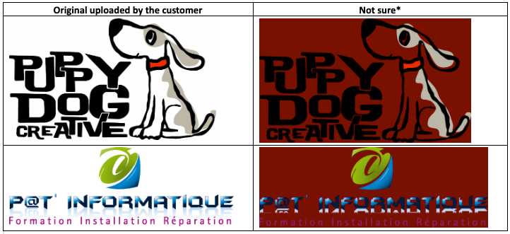
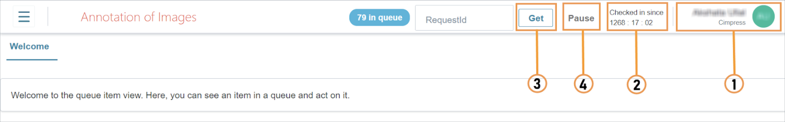
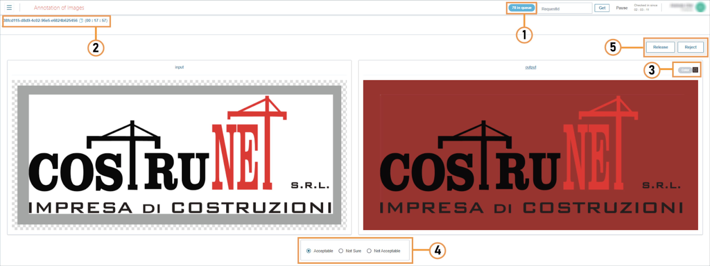

!!! example "About this article "
    This document was used by the AI/ML Engineers to train the in-house team of 50+ graphic designers for data annotation during the development of AI-based image-processing APIs.

## Introduction and Objective
The **Image Processing** team is working on automatic removal of the background from lineart images uploaded by the customer. In many cases, the output image generated after removing the background may have some regions missing since they are of the same color as the background, or it may have unwanted changes such as pixelation, fuzziness, or irregular patches that were not present in the original image. 

The objective of this annotation project is to compare the original input image and the output image and identify whether the background removal process was carried out correctly or not.

## Task

In this project, you are required to categorize the image into three types: **Acceptable**, **Not Acceptable**, and **Not Sure**.    

**Identifying ACCEPTABLE images:** Generally, the background removal result looks good, appearance to the original artwork is preserved and there are very little or no artifacts. Also, holes in the artwork are filled in only where necessary.    

**Identifying UNACCEPTABLE images:** The appearance to the original artwork is not preserved and major artifacts are present. Important holes are not filled in, and some holes are filled in where they shouldn’t be. Also, there would be partially removed gradients/drop shadows that weren’t there in the original image.

The following images show the categorization:
!!! note "NOTE"
    The red background in the columns are for illustration purposes only, and have been used in order to view the background removal results more clearly.

**Identifying NOT SURE images:** The appearance to the original artwork is preserved, and the artifacts aren’t bad – this categorization is for images that are acceptable in principle, but could be better, or it is unclear whether the final result will be acceptable for a customer.   

## How to Launch and Use the Annotation App
* Click https://annotation-review.pxxnss.cxxxznss.io/ 

* Log in using your **Auth0** credentials

* The **Annotation** workspace is displayed:   

1. User ID Display
2. Check in time
3. Click **Get** to fetch a request
4. Click **Pause** if you require to temporarily stop processing your requests. 
5. Select an option from the list and click **Done**. 
6. Click **Resume** to continue processing requests.

## How to Annotate an Image

**Step I**

Click **Get** to fetch a request. The artwork is displayed in the workspace.    

**(1)** Displays the number of requests in the queue    

**(2)** Displays the request ID and processing time for the artwork currently open in the workspace.    

* **Input**: Displays the original artwork uploaded by the customer.    
* **Output**: Displays the artwork with the background removed.    

The output image is placed on an animated background whose color is constantly changing. This is done to help you to easily spot any problems in the output image. 

Use the **Color** option **(3)** if you want to apply a specific background color to the image in order to identify any image issues. 

**Step II**

In **(4)**, mark one of the following options for the output image:

- **Acceptable:** When the artwork is clean, distinct, and no irregular patches are visible.

- **Not Sure:** When the artwork appears clear but there may be some fuzzy or pixelated patches within the image. 

- **Not Acceptable:** When the artwork is pixelated, fuzzy, has some missing regions, or background patches are visible within the image.

**Step III**

Click **Release (5)** to complete the current request and move it to further processing.