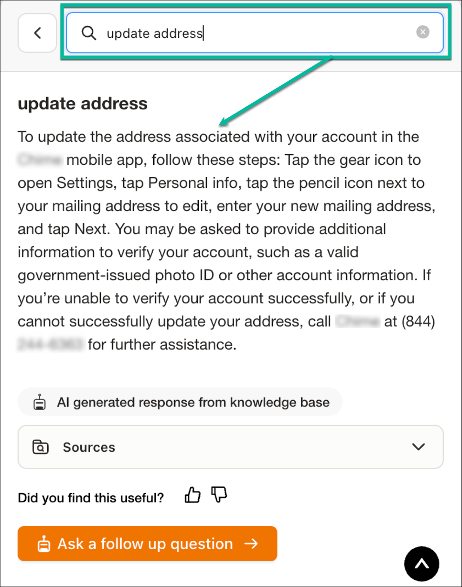
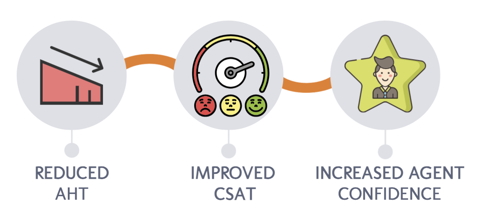
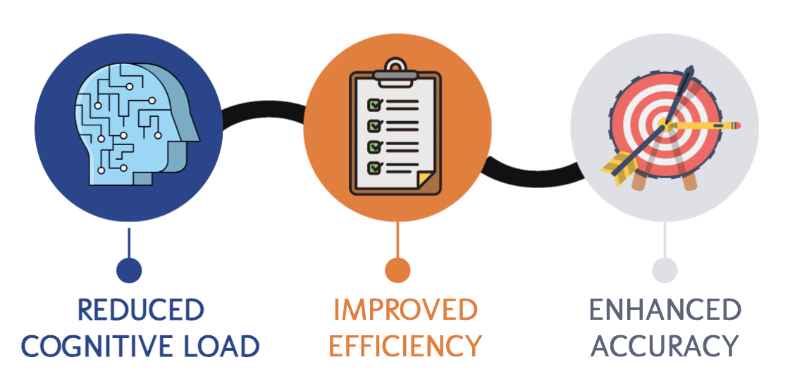
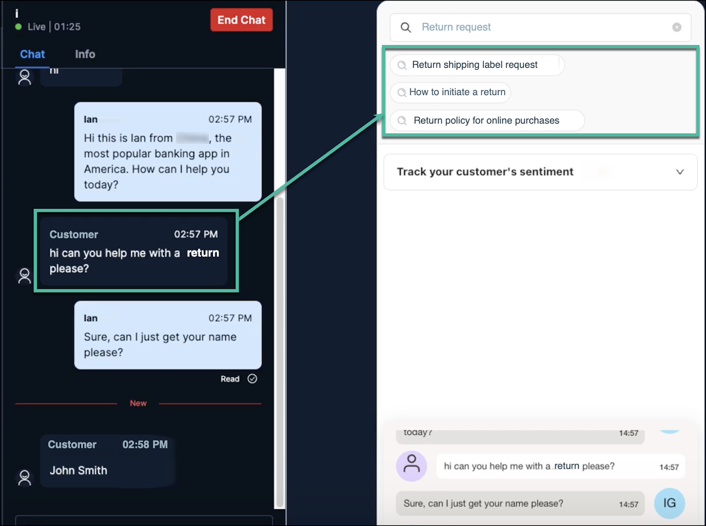
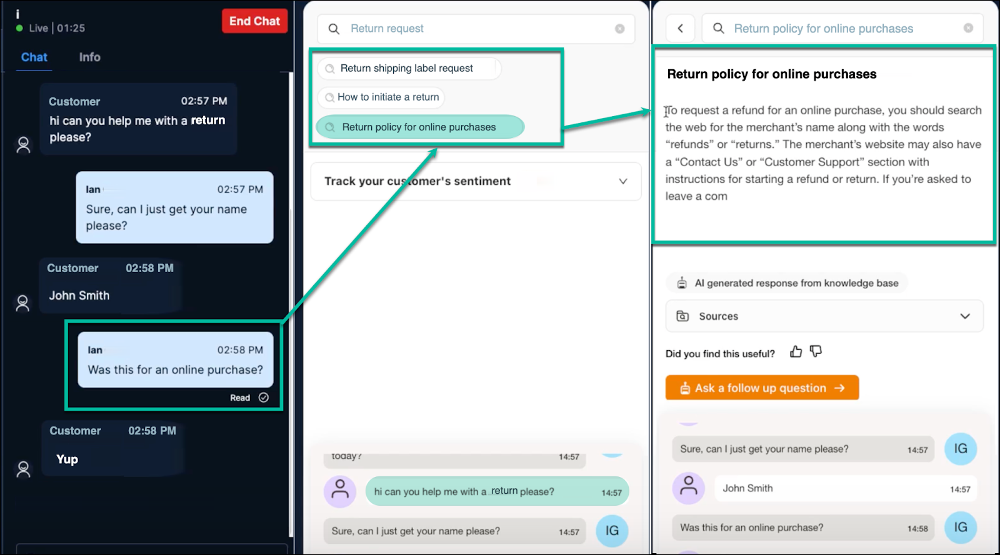

## Overview

Contact center agents have several challenges irrespective of the industry to which they belong, the common ones being:

*   **New agent struggles:** It's tough for new agents to learn everything quickly.
*   **Knowledge pressure:** Expected to be experts on all topics.
*   **Inconsistence in answers:** Agents have varying levels of expertise and give different answers, which can frustrate customers.
*   **Fear of asking for help** because they’re afraid to look dumb.
*   **Customer frustration:** Putting customers on hold to search for information can lead to further frustration.
*   **Note-taking struggles:** Balancing note-taking with maintaining focus on the conversation.
*   **Overwhelming workload:** High call volume, limited support, and emotional exhaustion.

To address these challenges, **Zumo AI** has designed **AgentGPT** and **Suggested Queries,** AI-powered solutions that empower your agents to deliver exceptional customer service.

## AgentGPT

**AgentGPT** acts like a virtual assistant, providing agents with the right information when you need it. If you’re stuck or need help in **real time**, ask **AgentGPT**! Get instant answers and expert suggestions without the awkward wait or fear of asking "silly" questions. Instead of sifting through long articles, you’ll receive only the most relevant information from across multiple articles, saving your time and improving efficiency.  
  

{ width="400" height="350" }

### Benefits of AgentGPT

▶ **Reduced AHT:** By providing quick access to information, **AgentGPT** helps agents resolve issues more efficiently, leading to lower AHT.

▶ **Improved CSAT:** Empowered agents can provide faster and more accurate solutions, leading to happier customers and higher CSAT scores.

▶ **Increased Agent Confidence:** **AgentGPT** provides agents with the support they need to feel confident and knowledgeable, reducing stress and improving job satisfaction.

{ width="550" height="500" }

## Suggested Queries

We recognize that managing a conversation with both a customer and a bot simultaneously can be challenging for agents. **Suggested Queries** simplifies the use of AgentGPT, making it easier for agents to access their knowledge base. Here's how it works:

*   **Real-time Conversation Analysis**: **Level AI**'s models analyze the conversation between the agent and the customer in real-time, identifying the customer's intent and the topic of discussion.
*   **Intelligent Query Suggestions**: Based on the conversation analysis, **Suggested Queries** presents the agent with a list of relevant queries that are likely to yield helpful information from **AgentGPT**.
*   **Help with probing questions:** Sometimes, it’s not clear what exactly a customer is asking about. In this case, **Suggested Queries** could help you formulate questions to ask the customer in order to understand what their problem actually is.
*   **Agent Selection and Information Retrieval**: Finally, simply select the most appropriate query from the list, and **AgentGPT** instantly retrieves the relevant information from across your knowledge base.

### Benefits of Suggested Queries

▶ **Less thinking, more doing:** You don't have to figure out what questions to ask the bot during a call. **Suggested Queries** displays a variety of relevant questions that you can simply click for an answer; so, you can focus on the customer.

▶ **Faster answers:** Get the information you need quickly, so you can help customers faster and spend less time on each call.

▶ **Accurate Answers**: **Suggested Queries** ensures that you receive the most relevant information, so you can give accurate and consistent responses during your interactions.

{ width="550" height="500" }

## Example - AgentGPT and Suggested Queries in action

Imagine a customer calls in to inquire about returning a product. As the agent converses with the customer, **Suggested Queries** might offer options such as: _Return shipping label request_, _How to initiate a return_, and _Return policy for online purchases_.  
  

The agent can then select the most relevant query, and **AgentGPT** will provide the necessary information from the knowledge base, allowing the agent to quickly and accurately address the customer's request.

!!! info "INFO"  
    Both **AgentGPT** and **Suggested Queries** work in the background, providing support without overwhelming agents with information.