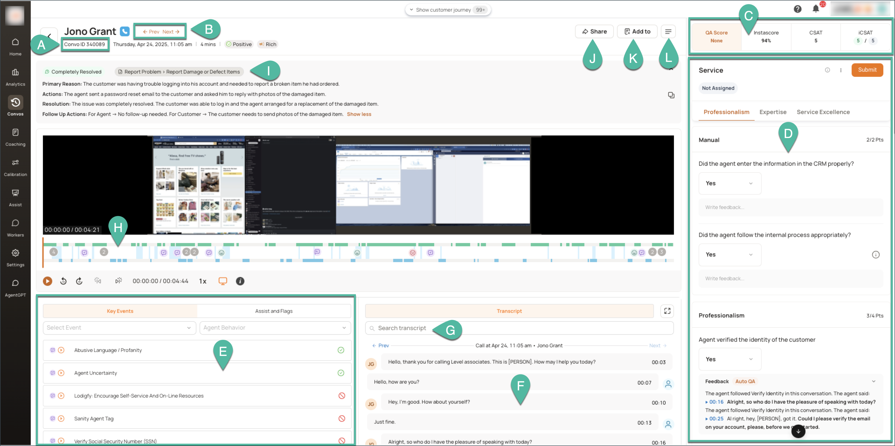
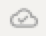
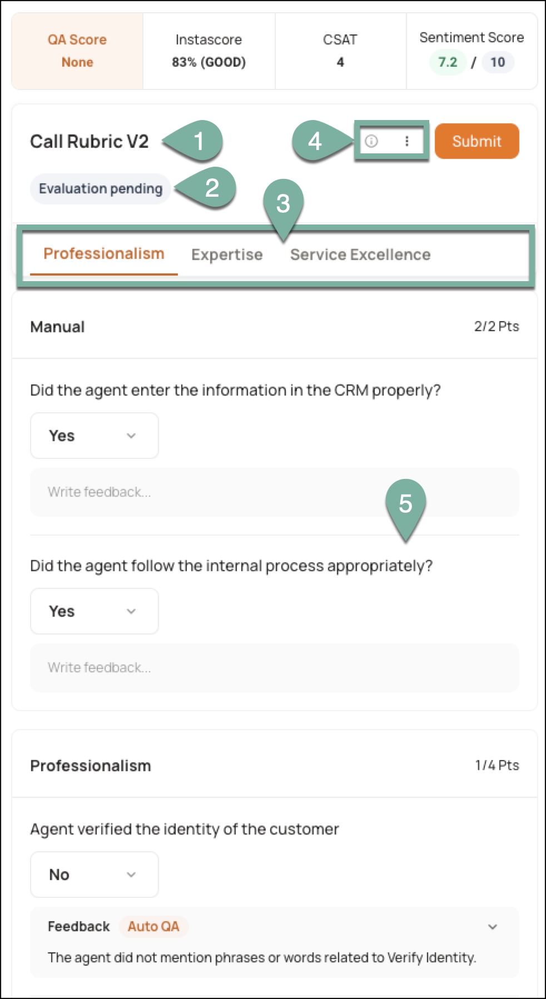

### Overall Layout

**(A)** Conversation ID

**(B)** Navigation to help you move between the previous and next evaluation.

**(C)** Evaluation scores such as **QA Score** (Manual), **Instascore** (Automated QA), **CSAT**, and **Sentiment Score**

**(D)** Rubric

!!! info "INFO"  
    Refer to _this article_ for a detailed description of the **Rubric** section.

**(E) Key Events** tab lists metric tags and conversation tags relevant to the conversation along with the corresponding audio snippet. Click{ width="40" height="40" }to expand and listen to the snippet.  
**Assists and Flags** tab lists the assist cards and flags generated during the conversation.

!!! tip "TIP"  
    Use the dropdown filters in the **Key Events** tab to conveniently find the desired tag.

**(F)** Transcripts of the conversation

**(G) Search Transcript**; use this field to look for specific customer or agent utterances

**(H)** Audio and Video recordings. You can use the controls to select a specific point or duration to which you want to listen/view.

!!! note "NOTE"  
    Audio files are generated only for calls.

**(I)** AI- generated **Conversation Summary**

**(J) Share;** use this button when you want to send the current conversation to other users.

**(K) Add to** Dropdown with:  
**\- Add to Library:** Allows you to add the current conversation to a library.  
**\- Add to Coaching:** Allows to you add the current conversation to a new or existing coaching session.

!!! info "INFO"  
    Refer to _this page_ for more information on coaching sessions.
    Refer to _this page_ for more information on libraries.

**(L)** Metadata button for viewing additional fields

### Rubric panel

On opening a conversation, you can view the following:  
  
**(1)** Name of the rubric used to evaluate the conversation  
\- The { width="40" height="40" } icon indicates automatic save i.e., the options you select or text you  
enter on the page are being saved every few seconds.  
  

{ width="400" height="250" }

**(2)** The status of the evaluation. This is dynamic and can display any one of the following statuses based on the actions you or an agent have taken:  
**Acceptance pending:** The agent is yet to view and accept the evaluation  
**Accepted:** The agent has viewed and fully accepted the evaluation  
**Disputed:** The agent, his/ her Team Manager, or Admin has disputed one or more questions in the evaluation  
  
**(3)** The sections of the rubric are displayed as tabs. You can click the tab name to directly move to a particular section.

**(4)** Click{ width="30" height="30" } to view the assignment rules of the rubric.

Click **⋮** for more options. Use the **Change Rubric** option if you want to replace the rubric used for evaluating the conversation.

**(5)** Questions contained in the respective section, based on which you need to evaluate the conversation. Use the dropdown to select your answers.