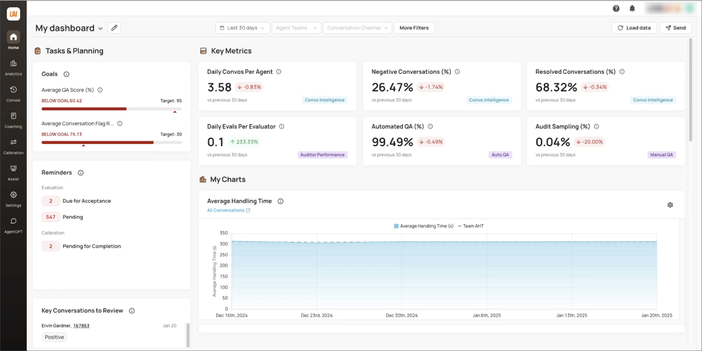
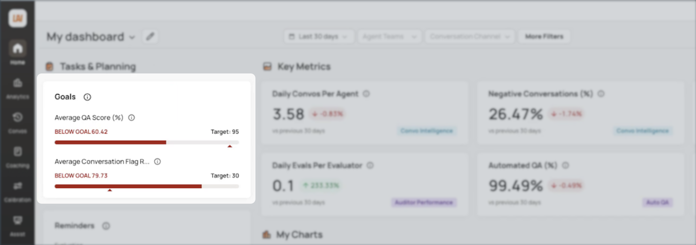
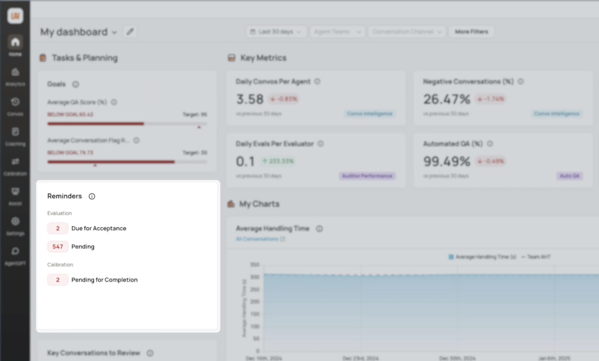
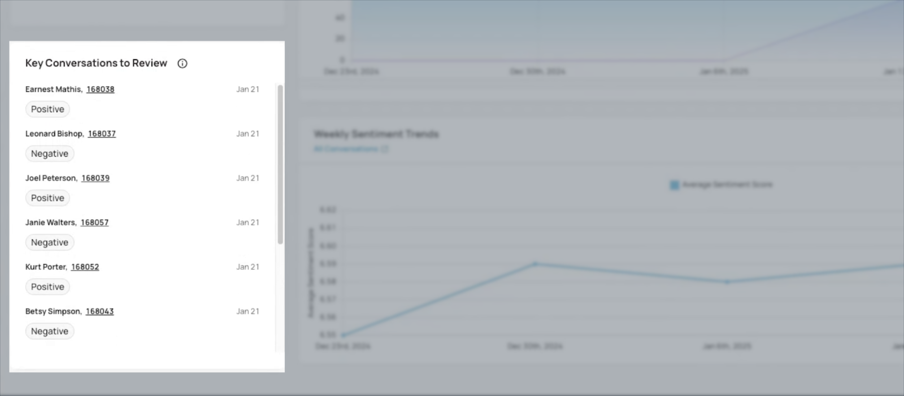
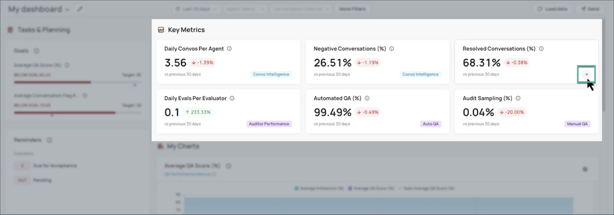
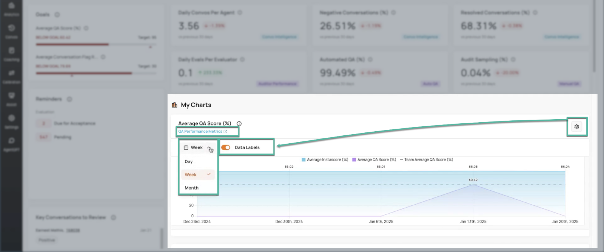
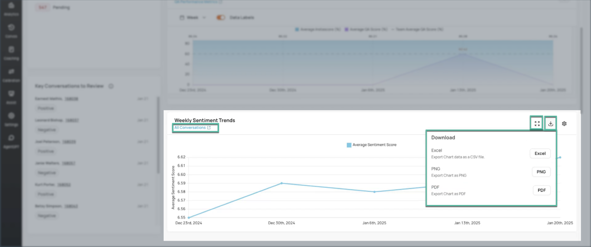
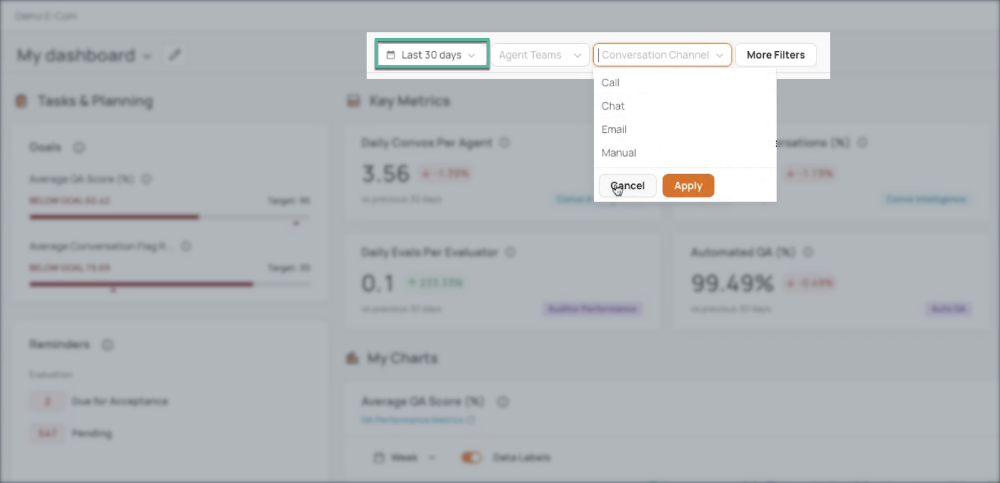

# Homepage Introduction

!!! quote "Keep in mind"
    This is an example of a chatbot-compatible help article.

## Short Description
The **Homepage** is your daily dashboard. It displays goals, reminders, key conversations, scorecards, charts, and filters tailored to your role. Use it to track progress, review tasks, and refresh data with one click.

The **Homepage** acts like your control panel; a quick snapshot of everything that matters right now.  
At a glance, you can see goals, reminders, team conversations, metrics, and charts.  
Why it matters: Unlike detailed reports (historical deep dives), the **Homepage** gives you a live feed of activity to guide your daily and weekly decisions.

## Sections of the Homepage

### Goals Widget

Purpose: Monitor progress toward performance objectives.      

Role-specific view:

* Admins / Super Admins: Organization-wide goals and agent-level tracking.  
* Managers / QA Auditors: Weekly team targets.  
* Agents: Only their individual goals.

!!! tip "Tip"
    Check this widget daily to know if you’re on track.

### Reminders Widget

Purpose: Displays pending tasks from the last 30 days.      

Role-specific items:

* Evaluations  
  * Agents: Conversations to review or disputed evaluations requiring action.  
  * QA Auditors: Assigned evaluations, pending evaluations, or disputes to resolve.  
* Calibrations: Details of calibration sessions where you are a moderator or participant.  
* Coaching: Outstanding items from coaching sessions.

Action: Click any item to open it directly.

### Key Conversations to Review

Purpose: Highlights conversations from the past 7 days that require attention.    

Role-specific view:

* Agents: Conversations to learn from and improve performance.  
* Managers / QA Auditors: Conversations with strong positive or negative sentiment handled by their team.

### Key Metrics

Purpose: Quick scorecards with performance indicators.      

Role-specific view:    

* Admins / Managers / QA Auditors / Super Admins: Six scorecards.  
* Agents: Three scorecards.

!!! note "Note"
    If you click into a scorecard, **Homepage** filters do not carry over.

### My Charts

Purpose: Visual summaries of data relevant to your role.     

Actions available:    

* Toggle labels or adjust time granularity.  
* Expand chart hyperlinks for detailed viewing.  
* Click links to explore deeper reports.  
* Download custom charts if a **Download** icon is shown.

### Homepage filters

Default: Last 30 days of data.  
Customization: Adjust filters to focus on specific time ranges.

!!! warning "Important"
    Filters do not apply to the **Reminders** or **Key Conversations** widgets.

### Load Data

Action: Click **Load Data** to refresh all **Homepage** widgets with the most up-to-date information.

!!! abstract "Related Articles"
    How to Customize the Homepage